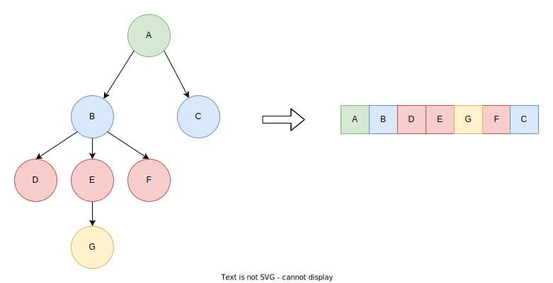

# NTS (NGram Tree Serialization) Format

---

## Tree Decomposition

The tree is flattened in a depth-first manner such that
any given node will be laid to the 'left' of its children:

|  |
|:--------------------------------------------------------------------------------------------------:|
|             ***Figure 1: A visualization of the depth-first tree flattening process***             |

Laid below is pseudocode describing the flattening process.

### Tree Flattening Pseudocode

---

```pseudocode
Stack[Node] stack = [];  // Create an empty stack to hold nodes to be processed.
stack.add(rootNode);     // Add the root node to the stack.

List[Node] flattened = [];  // Create an empty list to store the flattened tree.

// Perform depth-first traversal to flatten the tree.
while (not stack.isEmpty()) {
    Node currentNode = stack.pop();  // Pop the top node from the stack.
    flattened.append(currentNode);  // Add the current node to the flattened list.
    
    // Add child nodes to the stack for future processing.
    forEach (Node child in currentNode.getChildren()) {
        stack.add(child);
    }
}
```

## Serialization

Once the tree is flattened, nodes are encoded as binary 'blocks' which have
two variations: standard and back-reference blocks. Blocks are divided by 
indicator bytes which are defined by the codec in the file header.

### Header

The file header is 6 bytes and has three components: the magic bytes, 
the back-reference indicator byte, and the back-reference array size, 
respectively.

It looks like this:

```plaintext
NTSHeader{
    'ntsf'                   <-- magic header bytes
    BACKREFERENCE_BYTE       <-- byte used in serialization indicating the beginning of a backreference (on range [0xf8, 0xff])
    BACKREFERENCE_ARRAY_SIZE <-- the size of the backreference array (cannot exceed 255)
}
```

### Schema

| Parameter                | Byte Range             | Description                                                                                                                                                      |
|--------------------------|------------------------|------------------------------------------------------------------------------------------------------------------------------------------------------------------|
| BACKREFERENCE_BYTE       | (0xF7, 0xFD]           | Indicates the beginning of a back-reference node block                                                                                                           |
| END_WORD                 | BACKREFERENCE_BYTE + 1 | The beginning of the END_WORD_BYTE range which indicates the end of the word data in a node block and encodes the number of subsequent bytes storing N_CHILDREN. |
| BACKREFERENCE_ARRAY_SIZE | [0, 255]               | The size of the back-reference array used during serialization (utilised during deserialization)                                                                 |

### Standard Block

---

Most nodes will usually be encoded as standard blocks (unless 
the tree has lots of repeated nodes).

It looks like this:

`| WORD | END_WORD_BYTE | N_CHILDREN |`

Here is a table detailing each component of the standard block:

| WORD                          | END_WORD_BYTE                                                  | N_CHILDREN                                                                   |
|-------------------------------|----------------------------------------------------------------|------------------------------------------------------------------------------|
| The node's word ascii encoded | END_WORD + (the number of following bytes encoding N_CHILDREN) | The number of child nodes directly attached to this node (stored big-endian) |

### Back-Reference Block

---

In special cases, the number of bytes needed to store a block can be reduced by
storing the word as a reference to a previously encoded node with the same word.

It looks like this:

`| BACKREFERENCE_BYTE | REFERENCE | END_WORD_BYTE | N_CHILDREN |`

Here is a table detailing each component of the standard block:

| BACKREFERENCE_BYTE                                                   | REFERENCE                                                            | END_WORD_BYTE                                                  | N_CHILDREN                                                                   |
|----------------------------------------------------------------------|----------------------------------------------------------------------|----------------------------------------------------------------|------------------------------------------------------------------------------|
| A single byte signaling the beginning of a back-reference node block | The index of the backreference array where the node's word is stored | END_WORD + (the number of following bytes encoding N_CHILDREN) | The number of child nodes directly attached to this node (stored big-endian) |

As you can see, the tail end of this block (i.e., END_WORD_BYTE and N_CHILDREN) is the same as the standard block.

Backreferences are not a necessary part of the serialization process. However, they must be included
in any deserialization algorithm to accord with the NTS format. During both the serialization and 
deserialization processes, an array called the 'backreference array' is maintained and updated for 
each node processed. Indices for words inserted into the backreference array are computed by a standard 
rolling hash with a power of 97. Pseudocode detailing this process is available below:

#### Rolling Hash Pseudocode

---

```pseudocode
int computeRollingHash(string word) {
    const int BASE = 97; // The base for the rolling hash
    const int MODULO = BACKREFERENCE_ARRAY_SIZE; // The size of the hash table

    int hash = 0; // Initialize the hash value
    int p_pow = 1; // Initialize the power of the base

    for each character c in word.getCharArray() {
        int charValue = c - ' ' + 1; // Convert character to an integer value
        hash = (hash + (charValue * p_pow) % MODULO) % MODULO; // Update the hash
        p_pow = (p_pow * BASE) % MODULO; // Update the power of the base
    }

    return hash; // Return the final rolling hash
}
```

### Final Notes

Serialized N-Gram Tree files can have either the 'nts' or 'ngrams' extension for
recognition.

That's basically it.